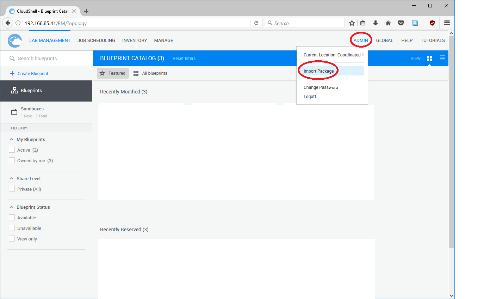
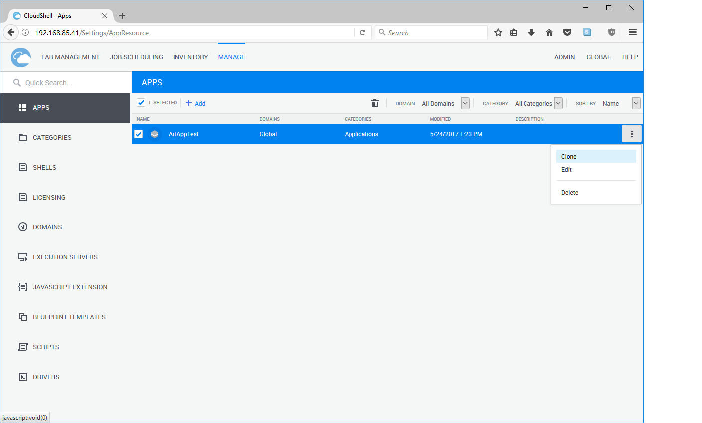
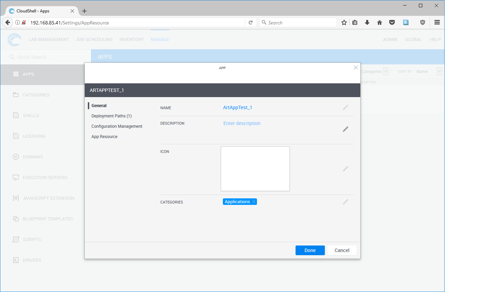
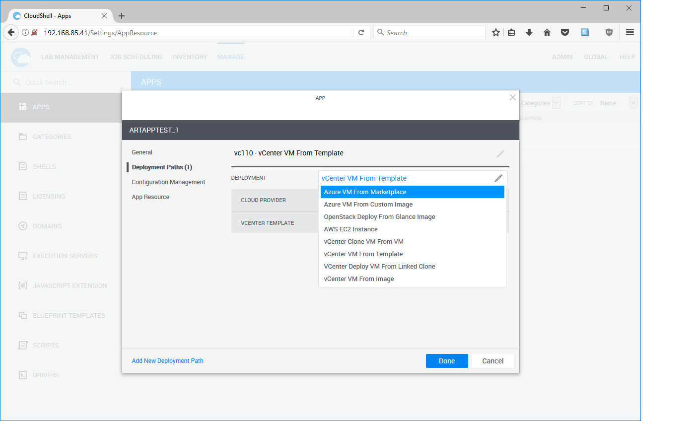
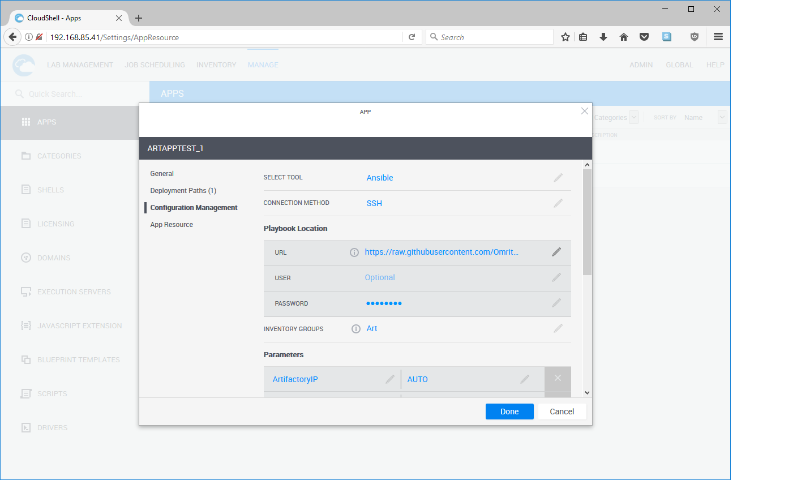
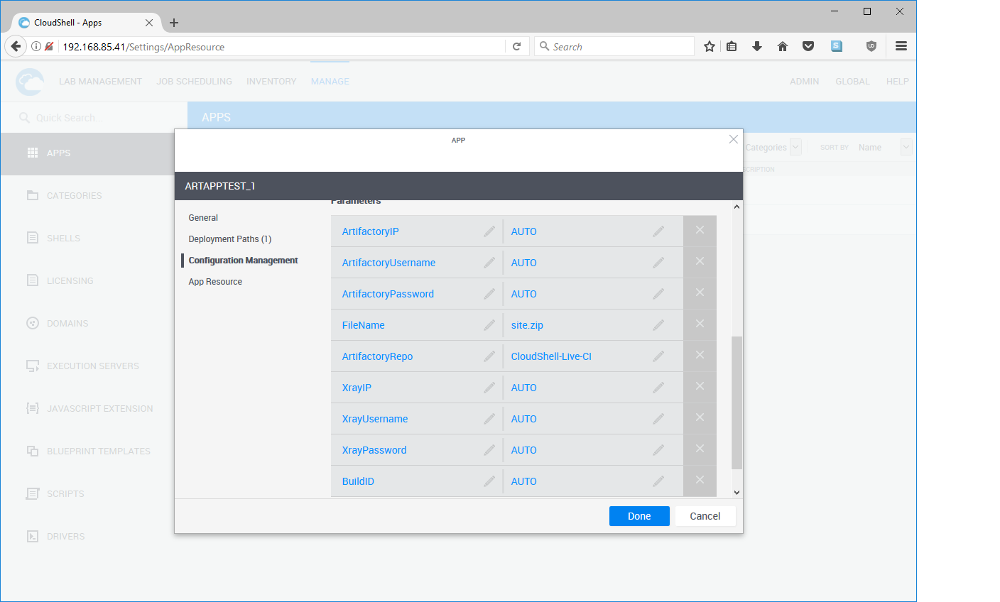
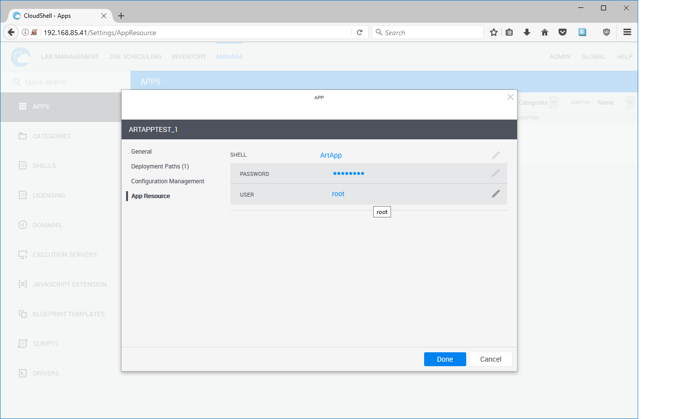

# JFrog-Artifactory-Xray-Plugin

## Overview

This ready-to-run example integrates JFrog Artifactory and Xray into a CloudShell app deployment. The app runs on a VM and an artifact from Artifactory is deployed onto it by CloudShell, via an Ansible playbook. Certain builds of the artifact (site.zip) may be blocked by Xray, in which case the deployment fails and a detailed explanation is extracted with a link back to the Xray details page.

The workflow is intended to be:

- The user reserves a sandbox that contains an app to be deployed on a new VM with an artifact from Artifactory
- The sandbox setup creates a new VM
- The sandbox runs an Ansible playbook on the new VM
- The Ansible playbook includes a Quali module that downloads the artifact from Artifactory, checks for Xray errors, and reports

The Ansible playbook is intended to be customized for each application and executed by CloudShell during deployment. As long as the playbook calls the Quali module, with a number of standard inputs automatically passed from CloudShell, the artifact will be ready on the VM for custom Ansible installation steps. 

In this example, the installation consists of unzipping the artifact, site.zip, into the Nginx web root folder.

## Prerequisites

- CloudShell 8.0 or higher
- Quali Linux execution server from the Quali download center

## Critical installation steps

- On the Quali Linux execution server appliance, run:

      yum install ansible

- Copy AnsibleModule/QSArtifactory.py to:

      /usr/lib/python2.7/site-packages/ansible/modules/QSArtifactory.py

-  Set in /etc/ansible/ansible.cfg under [defaults] section:

      host_key_checking = False

## App setup

Clone this repository to your local machine.

Go into Package/ and follow the instructions for creating Artifactory Example - CI-00.zip.

Import the package Artifactory Example - CI-00.zip into CloudShell by dragging it into any screen of the CloudShell portal while logged in, or with this menu command:

Go to the MANAGE tab, APPS section

You should see an app ArtAppTest

Mouse over the right edge of the ArtAppTest row, open the menu, and click Clone

### Edit the clone

#### Under General:

Set a name for the app as you want it to appear in the menu of apps. Optionally provide a description and icon.

#### Under Deployment Paths:

Select a deployment type and configure the cloud provider details for your system. You might have to create a cloud provider resource according to other documentation.

#### Under Configuration Management:

Set the Playbook Location URL to the full URL of a *.yml playbook file, for example https://raw.githubusercontent.com/Omritk/Test/master/QSArtifactoryPlaybook.yml. If the URL is password protected, enter the User and Password; otherwise leave them blank. In order to use the CloudShell integration with Artifactory and Xray, create a playbook based on the sample QSArtifactoryPlaybook.yml. 

Set Inventory Groups to the relevant inventory group name from the playbook.

Set the FileName and ArtifactoryRepo fields to correspond to your artifact name and repository name. For example, if your artifacts are typically accessed as https://artifactory:8081/artifactory/A/B-123/C, set ArtifactoryRepo to A and FileName to C. B-123 is the build id and will be set dynamically.

Leave all AUTO fields as AUTO. They will be overwritten dynamically during deployment.

#### Under App Resource:

Select the resource model that will created to represent the deployed VM. Be sure to set User and Password: they are needed by Ansible to log in to the new VM. Note: When defining a custom resource model in Resource Manager, you must attach the User and Password attributes to it.

